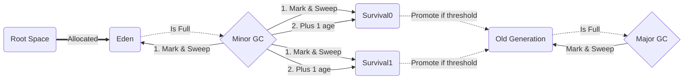

## JVM(Java Virtual Machine)이란?
운영체제의 메모리 영역에 접근하여 메모리를 관리하는 프로그램이다.
- 메모리 관리
- Garbage Collector 수행

## Memory Allocation

Stack
: **정적으로 할당**한 메모리 영역으로 원시 타입의 데이터[^immutable-value]가 값과 함께 할당, Heap 영역에 생성된 Object 타입의 참조값이 할당

Heap
: **동적으로 할당**한 메모리 영역으로 모든 Object 타입의 데이터가 할당. Heap 영역의 객체를 가리키는 참조 변수가 Stack 영역에 할당

## Garbage Collector
>_Garbage collection was invented by American computer scientist John McCarthy around 1959 to simplify manual memory management in Lisp._

**장점**

Java 응용프로그램에서 `동적으로 할당된 메모리` 중 더 이상 사용하지 않는 메모리를 자동으로 확보하는 프로세스이며 메모리 누수(memory leak) 및 기타 관련 버그의 원인이 될 수 있는 메모리 할당 및 할당 해제를 수동으로 관리해야 하는 부담을 덜어주는 Java의 중요한 기능입니다.

**단점**
- 어떠한 메모리 영역이 해제의 대상이 될지 검사하고 해제하는 일은 우리의 프로그램이 해야 하는 일을 못하도록 방해하는 오버헤드이다.
- 개발자는 언제 GC가 메모리를 해제하는지 모른다.

### Garbage Collector Process
**Mark and Sweep**
1. Garbage Collector 가 Stack 의 모든 변수를 스캔하면서 `unreachable`, `reachable` 객체를 식별하고 마킹합니다.
2. Reachable Object 가 참조하고 있는 객체도 찾아서 마킹합니다.
3. 마킹되지 않은 개체를 `Heap` 영역에서 제거합니다.
4. Mark and Sweep 알고리즘에 따라 다르지만 `Heap` 영역의 객체를 이동시키는 `Compaction` 과정이 추가될 수 있습니다.



### stop-the-world
Garbage Collector 가 실행되는 동안 Java 응용프로그램의 모든 스레드가 중단되는 현상을 의미합니다.

### Garbage Collector 종류
**Serial GC**
- Garbage Collector 가 하나의 스레드로 동작합니다.
- `stop-the-world` 시간이 길어질 수 있습니다.
- Compact 가 포함된 Mark and Sweep 알고리즘을 사용합니다.

**Parallel GC**
- `Java 8` 의 기본 Garbage Collector 입니다.
- `Young Generation 영역`에 대한 Garbage Collector 가 멀티 스레드로 동작합니다.
- Serial GC 보다 `stop-the-world` 시간이 짧습니다.
- ape-bit 가 15가 되면 promotion 이 발생한다.

**Parallel Old GC**
- `Java 8` 의 기본 Garbage Collector 입니다.
- `Old Generation 영역`에서도 Garbage Collector 가 멀티 스레드로 동작합니다.
- Mark-Summary-Compaction 알고리즘을 사용합니다.
  - sweep: 단일 쓰레드가 old 영역 전체를 훓는다.
  - summary: 멀티 쓰레드가 old 영역을 분리해서 훓는다.

**CMS(Concurrent Mark Sweep) GC**
- stop-the-world 시간을 줄이기 위해 고안되었다.
- unreachable 객체를 찾는 과정을 순차적으로 나누어 수행한다.
- compact 과정이 없다.

**G1(Garbage First) GC**
- CMS GC 의 단점을 보완하기 위해 고안되었다.
- Java 9 부터 기본 Garbage Collector 로 사용된다.
- Heap을 일정한 크기의 영역으로 나누어 관리한다.
- 전체 Heap이 아닌 영역 단위로 탐색한다.
- compact 과정이 없던 CMS와 달리 compact 과정을 포함한다.

### Example Code
```java
public class StackHeapExample {
    public static void main(String[] args) {
        int num1 = 10;
        int num2 = 2;
        int sum = num1 + num2;

        String name = "Hello World";

        System.out.println(sum);
        System.out.println(name);
    }
}
```
1. 원시 타입의 데이터 `int` 는 Stack 영역에 할당되며 `num1 = 10`, `num2 = 2`, `sum = num1 + num2` 가 Stack 영역에 할당됩니다.
2. `String` 객체타입의 데이터는 Heap 영역에 할당되며 `(String)"Hello World"` 가 Heap 영역에 할당됩니다.
3. `name` 변수는 `String` 객체타입의 참조값을 가리키는 참조 변수이며 `name = <주소지>` 가 Stack 영역에 할당됩니다.
4. `main()` 함수가 종료되면서 Stack 영역에 할당된 모든 변수는 메모리에서 제거됩니다.
5. Heap 영역에 할당된 모든 객체는 `Unreachable Object` 상태가 되며 `Garbage Collector` 가 실행되어 메모리에서 제거됩니다.

## JVM GC Tuning
GC 튜닝은 성능 개선의 최종 단계이며 객체 생성 자체를 줄이려는 코드 레벨에서의 최적화가 선행되어야 한다.

### Goal
- `Promotion` 되는 객체를 최소화하기
- Major GC 시간을 짧게 유지하기

### Process
- GC 상태를 모니터링 한다.
- 어플리케이션 성격에 알맞은 GC 알고리즘을 선택하고 메모리 크기를 설정한다.
- GC 알고리즘에 따라 JVM 옵션을 설정한다.

### Command
**Java 환경**
```shell
$ java -XX:+PrintCommandLineFlags -version
-XX:G1ConcRefinementThreads=8 -XX:GCDrainStackTargetSize=64 -XX:InitialHeapSize=524387904 -XX:MaxHeapSize=8390206464 -XX:+PrintCommandLineFlags -XX:ReservedCodeCacheSize=251658240 -XX:+SegmentedCodeCache -XX:+UseCompressedClassPointers -XX:+UseCompressedOops -XX:+UseG1GC
openjdk version "11.0.15" 2022-04-19 LTS
OpenJDK Runtime Environment 18.9 (build 11.0.15+9-LTS)
OpenJDK 64-Bit Server VM 18.9 (build 11.0.15+9-LTS, mixed mode, sharing)
```

**jstat tool(gcutil)**
```shell
# jstat -gcutil -t <PID> <MS> <COUNT>
$ jstat -gcutil -t 9786 1000 10
Timestamp     S0     S1      E      O      M    CCS    YGC     YGCT   FGC     FGCT   CGC     CGCT      GCT
    151.1   0.00 100.00  41.61  53.80  96.22  88.63     18    0.198     0    0.000     8    0.020    0.218
    152.1   0.00 100.00  41.61  53.80  96.22  88.63     18    0.198     0    0.000     8    0.020    0.218
    153.1   0.00 100.00  41.61  53.80  96.22  88.63     18    0.198     0    0.000     8    0.020    0.218
    154.1   0.00 100.00  41.61  53.80  96.22  88.63     18    0.198     0    0.000     8    0.020    0.218
    155.1   0.00 100.00  41.61  53.80  96.22  88.63     18    0.198     0    0.000     8    0.020    0.218
    156.1   0.00 100.00  41.61  53.80  96.22  88.63     18    0.198     0    0.000     8    0.020    0.218
    157.1   0.00 100.00  41.61  53.80  96.22  88.63     18    0.198     0    0.000     8    0.020    0.218
    158.1   0.00 100.00  41.61  53.80  96.22  88.63     18    0.198     0    0.000     8    0.020    0.218
    159.1   0.00 100.00  41.61  53.80  96.22  88.63     18    0.198     0    0.000     8    0.020    0.218
    160.1   0.00 100.00  41.61  53.80  96.22  88.63     18    0.198     0    0.000     8    0.020    0.218
```

**jstat tool(gcutil)**
```shell
# jstat -gccapacity -t <PID> <MS> <COUNT>
$ jstat -gccapacity -t 9786 1000 10
Timestamp    NGCMN     NGCMX      NGC    S0C     S1C       EC      OGCMN      OGCMX        OGC         OC     MCMN      MCMX       MC    CCSMN     CCSMX     CCSC    YGC   FGC   CGC
    428.8      0.0 2097152.0 186368.0    0.0 21504.0 164864.0        0.0  2097152.0   131072.0   131072.0      0.0 1136640.0 102428.0      0.0 1048576.0  14540.0     18     0     8
    429.9      0.0 2097152.0 186368.0    0.0 21504.0 164864.0        0.0  2097152.0   131072.0   131072.0      0.0 1136640.0 102428.0      0.0 1048576.0  14540.0     18     0     8
    430.9      0.0 2097152.0 186368.0    0.0 21504.0 164864.0        0.0  2097152.0   131072.0   131072.0      0.0 1136640.0 102428.0      0.0 1048576.0  14540.0     18     0     8
    431.9      0.0 2097152.0 186368.0    0.0 21504.0 164864.0        0.0  2097152.0   131072.0   131072.0      0.0 1136640.0 102428.0      0.0 1048576.0  14540.0     18     0     8
    432.9      0.0 2097152.0 186368.0    0.0 21504.0 164864.0        0.0  2097152.0   131072.0   131072.0      0.0 1136640.0 102428.0      0.0 1048576.0  14540.0     18     0     8
    433.9      0.0 2097152.0 186368.0    0.0 21504.0 164864.0        0.0  2097152.0   131072.0   131072.0      0.0 1136640.0 102428.0      0.0 1048576.0  14540.0     18     0     8
    434.9      0.0 2097152.0 186368.0    0.0 21504.0 164864.0        0.0  2097152.0   131072.0   131072.0      0.0 1136640.0 102428.0      0.0 1048576.0  14540.0     18     0     8
    435.9      0.0 2097152.0 186368.0    0.0 21504.0 164864.0        0.0  2097152.0   131072.0   131072.0      0.0 1136640.0 102428.0      0.0 1048576.0  14540.0     18     0     8
    436.9      0.0 2097152.0 186368.0    0.0 21504.0 164864.0        0.0  2097152.0   131072.0   131072.0      0.0 1136640.0 102428.0      0.0 1048576.0  14540.0     18     0     8
    437.9      0.0 2097152.0 186368.0    0.0 21504.0 164864.0        0.0  2097152.0   131072.0   131072.0      0.0 1136640.0 102428.0      0.0 1048576.0  14540.0     18     0     8
```

### Setting
- Heap 크기 설정
  - `-Xms: Initial Heap Size`
  - `-Xmx: Max Heap Size`
- Young 영역 크기 설정
  - `-Xmn: Young 영역의 크기`
  - `-XX:NewRatio: Old 영역의 크기를 Young 영역의 크기로 나눈 비율`
  - `-XX:NewSize: Young 영역의 초기 크기`
  - `-XX:MaxNewSize: Young 영역의 최대 크기`
  - `-XX:SurvivorRatio: Eden 영역과 Survivor 영역의 비율`
- GC 실행 방식 설정
  - `-XX:+UseSerialGC: Serial GC`
  - `-XX:+UseParallelGC: Parallel GC`
  - `-XX:+UseConcMarkSweepGC: CMS GC`
  - `-XX:+UseG1GC: G1 GC`

## Reference
- <https://johngrib.github.io/wiki/jvm-memory/>
- <https://d2.naver.com/helloworld/1329>
- <https://docs.oracle.com/en/java/javase/14/docs/api/java.base/java/lang/System.html#gc()>
- <https://www.youtube.com/watch?v=vZRmCbl871I>

## Footnotes
[^immutable-value]: 원시 타입이란 `boolean`, `byte`, `char`, `short`, `int`, `long`, `float`, `double` 이다.
