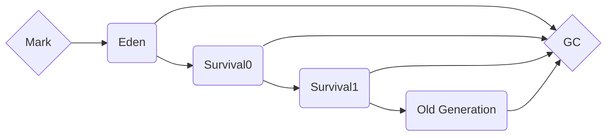

## JVM(Java Virtual Machine)이란?
운영체제의 메모리 영역에 접근하여 메모리를 관리하는 프로그램이다.
- 메모리 관리
- Garbage Collector 수행

## Garbage Collector
>_Garbage collection was invented by American computer scientist John McCarthy around 1959 to simplify manual memory management in Lisp._

Java 응용프로그램에서 `동적으로 할당된 메모리` 중 더 이상 사용하지 않는 메모리를 자동으로 확보하는 프로세스이며 메모리 누수(memory leak) 및 기타 관련 버그의 원인이 될 수 있는 메모리 할당 및 할당 해제를 수동으로 관리해야 하는 부담을 덜어주는 Java의 중요한 기능입니다.

### Garbage Collector Process
1. Garbage Collector 가 Stack 의 모든 변수를 스캔하면서 참조하고 있는 객체를 찾고 마킹합니다.
2. Reachable Object 가 참조하고 있는 객체도 찾아서 마킹합니다.
3. 마킹되지 않은 개체를 Heap 영역에서 제거합니다.



> 가비지 컬랙터 과정은 `Mark and Sweep` 과정이라고도 합니다.
{: .prompt-info }

### Example Code
```java
public class GarbageCollectionExample {
    public static void main(String[] args) {

        String str1 = new String("Hello");
        String str2 = new String("World");

        str1 = str1;

        System.gc();
    }
}
```
1. 위의 예제코드에서 두 개의 String 객체가 생성되고 값이 할당됩니다.
2. 이후 `str1` 변수에 `str2` 값이 다시 할당되어 `str1` 변수는 가비지 수집 대상이 됩니다.
3. 가비지 수집을 명시적으로 요청하기 위해 `System.gc()` 함수를 호출합니다.
4. JVM 은 정기적으로 `Garbage Collector` 를 실행하여 가비지 수집 대상의 객체의 메모리를 회수합니다.

## Memory Allocation

Stack
: **정적으로 할당**한 메모리 영역으로 원시 타입의 데이터[^immutable-value]가 값과 함께 할당, Heap 영역에 생성된 Object 타입의 참조값이 할당

Heap
: **동적으로 할당**한 메모리 영역으로 모든 Object 타입의 데이터가 할당. Heap 영역의 객체를 가리키는 참조 변수가 Stack 영역에 할당

### Example Code
```java
public class StackHeapExample {
    public static void main(String[] args) {
        int num1 = 10;
        int num2 = 2;
        int sum = num1 + num2;

        String name = "Hello World";

        System.out.println(sum);
        System.out.println(name);
    }
}
```
1. 원시 타입의 데이터 `int` 는 Stack 영역에 할당되며 `num1 = 10`, `num2 = 2`, `sum = num1 + num2` 가 Stack 영역에 할당됩니다.
2. `String` 객체타입의 데이터는 Heap 영역에 할당되며 `(String)"Hello World"` 가 Heap 영역에 할당됩니다.
3. `name` 변수는 `String` 객체타입의 참조값을 가리키는 참조 변수이며 `name = <주소지>` 가 Stack 영역에 할당됩니다.
4. `main()` 함수가 종료되면서 Stack 영역에 할당된 모든 변수는 메모리에서 제거됩니다.
5. Heap 영역에 할당된 모든 객체는 `Unreachable Object` 상태가 되며 `Garbage Collector` 가 실행되어 메모리에서 제거됩니다.

## Reference
- <https://johngrib.github.io/wiki/jvm-memory/>
- <https://d2.naver.com/helloworld/1329>
- <https://docs.oracle.com/en/java/javase/14/docs/api/java.base/java/lang/System.html#gc()>
- <https://www.youtube.com/watch?v=vZRmCbl871I>

## Footnotes
[^immutable-value]: 원시 타입이란 `boolean`, `byte`, `char`, `short`, `int`, `long`, `float`, `double` 이다.
