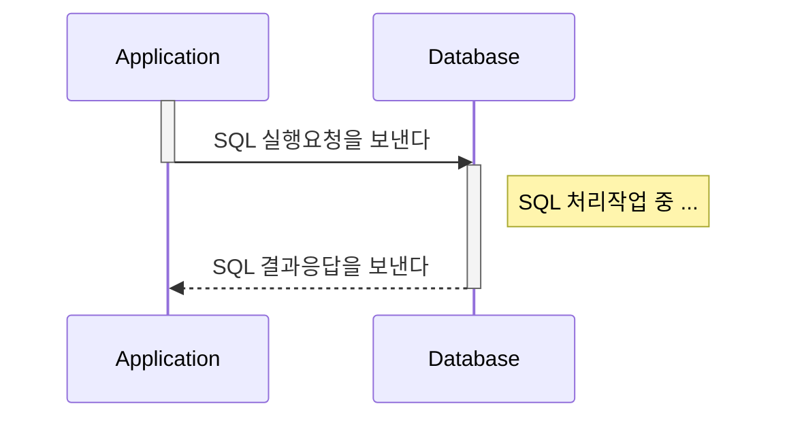
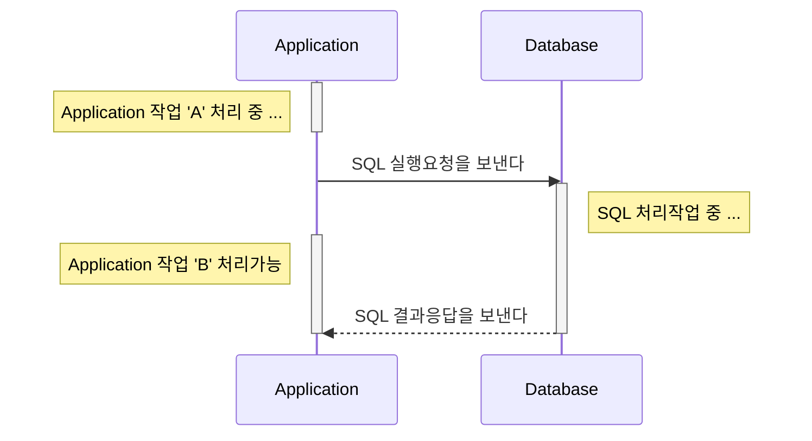
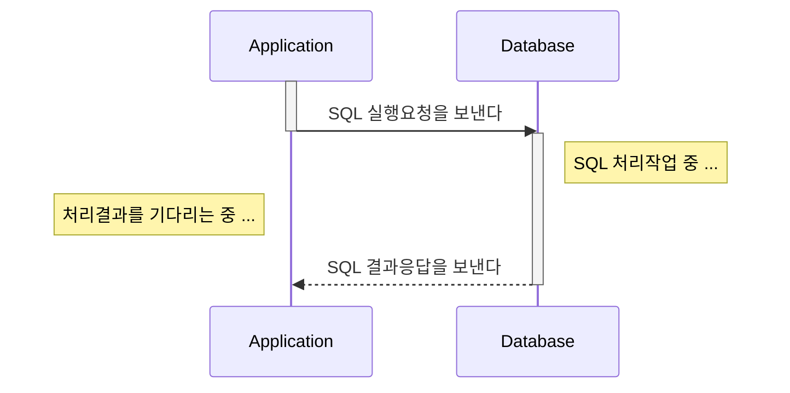
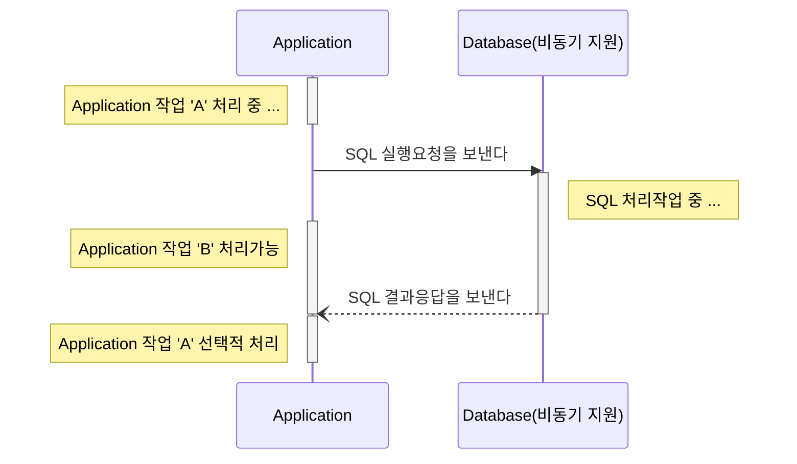

## Goal

- [x] Sync 와 Async 그리고 Blocking 과 Non-Blocking 을 설명할 수 있다.
- [x] Sync 와 Async 그리고 Blocking 과 Non-Blocking 이 왜 중요한지 설명할 수 있다.

## Blocking vs Non-Blocking

### Blocking

자신의 작업을 진행하다가 **다른 주체**의 작업이 시작되면 **다른 주체**의 작업이 끝날 때까지 `기다렸다`가 자신의 작업을 시작하는 것

### Non-Blocking

다른 주체의 작업에 `관련없이` 자신의 작업을 하는 것

### 핵심요약
> `다른 주체`가 작업할 때 `자신의 제어권`이 본인에게 있는지 여부로 정리할 수 있다.
{: .prompt-tip }

## Synchronous vs Asynchronous

### Synchronous

사전적 용어로는 `동기` 라는 뜻을 가지며 작업을 동시에 수행하거나, 동시에 끝나거나, `끝나는 동시에 시작함을 의미`한다.

### Asynchronous

사전적 용어로는 `비동기` 라는 뜻을 가지며 시작, 종료가 일치하지 않고 `끝나는 동시에 시작을 하지 않음`을 의미한다.

### 핵심요약
> 결과를 돌려주었을 때 `순서와 결과`에 관심이 있는지 여부로 정리할 수 있다.
{: .prompt-tip }

## 포스팅을 마치며
동기, 비동기 그리고 블로킹과 논블로킹은 소프트웨어 개발에서 중요한 개념이다. 이들은 어떻게 코드가 동작하는지, 어떤 방식으로 다른 리소스와 상호작용하는지에 대한 설명을 제공합니다. 개인 학습을 마치며 이러한 주제가 실무관점에서 어떤 이유로 중요한지 아래와 같이 정리하였습니다.

#### 프로그램 반응성
`동기 & 블로킹` 코드는 요청을 처리하는 동안 다른 요청을 처리하지 못하므로, 다른 요청이 대기하는 동안 시스템이 느려지는 경향이 있습니다. 이러한 상황은 대규모 응용 프로그램에서 극단적인 상황으로 발전할 수 있습니다. 반면, `비동기 & 논블로킹` 방식은 `다중 스레드`를 통해 요청을 처리하므로 시스템의 반응성이 향상됩니다.

#### 시스템 처리량
`동기 & 블로킹` 코드는 대기열이 존재할 경우 시스템의 처리량이 낮아질 가능성이 있습니다. 이는 많은 양의 데이터가 처리되어야 하는 대규모 시스템에서 매우 문제가 될 수 있습니다. `비동기 & 논블로킹` 코드는 대기열에 따라 처리량이 증가하므로, 대규모 시스템에서 더 나은 성능을 제공합니다.

#### 자원 활용
`동기 & 블로킹` 방식에서는 한 번에 하나의 요청만 처리할 수 있습니다. 반면, `비동기 & 논블로킹` 방식에서는 요청을 처리하는 동안 다른 요청을 처리할 수 있으므로, 리소스 활용이 효율적입니다. 또한, 동기 방식에서는 대기 중인 요청이 많을수록 메모리 사용량이 증가합니다. 비동기 방식에서는 대기열에 따라 메모리 사용량이 증가할 수 있지만, 일반적으로 메모리 사용량이 더 적습니다.

따라서, 동기와 비동기, 블로킹과 논블로킹 개념은 소프트웨어 개발에서 매우 중요합니다. 이 개념을 잘 이해하면 프로그램의 성능, 처리량, 반응성을 향상시키고, 시스템의 자원 사용을 최적화하는 데 도움이 됩니다.

## Quiz
- 여기서 `자신` 이라는 주체는 정확히 무엇을 말하는 것인가?
- Blocking with Synchronous 에 대한 설명과 대표적인 사례를 설명하시오
- Non-Blocking with Synchronous 에 대한 설명과 예상되는 발생 문제
- Blocking with Asynchronous 에 대한 설명과 어떤 문제로 해당 조합이 발생되는지 사례생각
- Non-Blocking with Asynchronous 에 대한 설명과 Spring 에서 어떤 조합으로 구성이 가능한가?

## Reference



