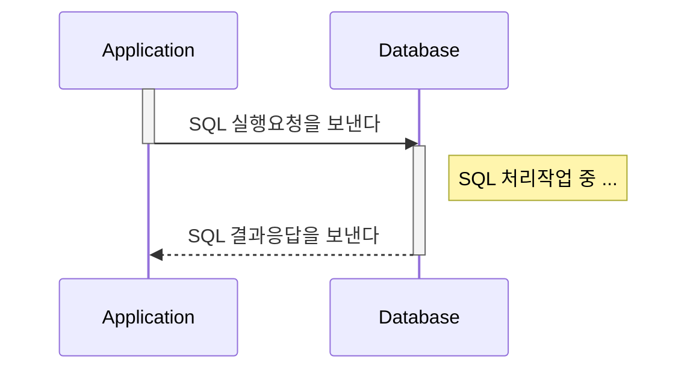
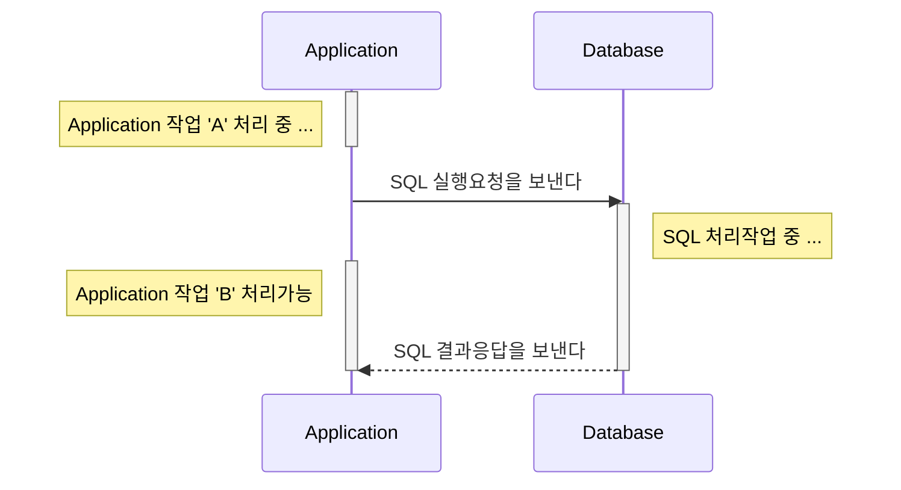
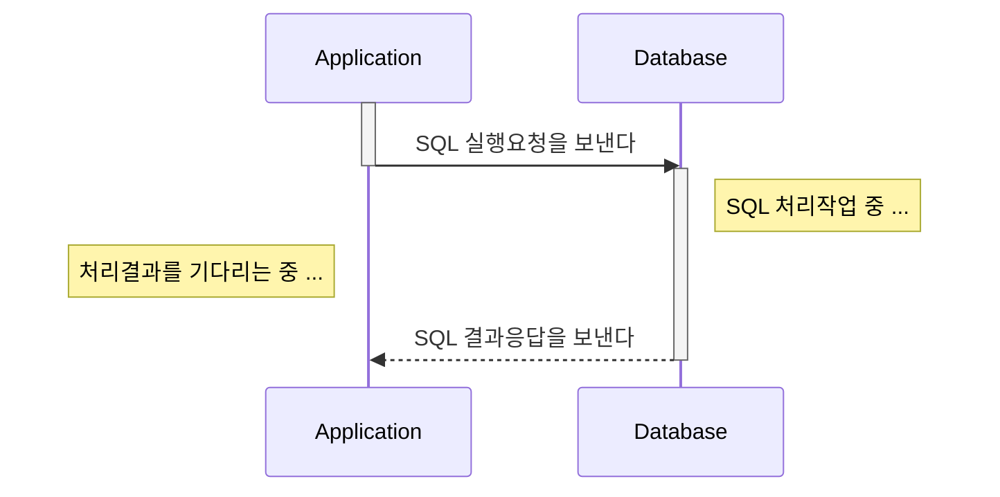
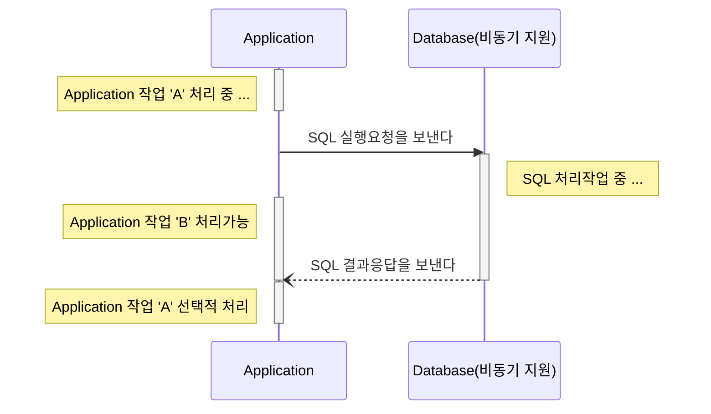

## Goal

- [x] Sync 와 Async 그리고 Blocking 과 Non-Blocking 을 설명할 수 있다.
- [x] Sync 와 Async 그리고 Blocking 과 Non-Blocking 이 왜 중요한지 설명할 수 있다.

## Important factors for handling high traffic volume
- 프로그램 반응성
- 시스템 처리량
- 자원의 활용

## Blocking vs Non-Blocking

### Blocking

자신의 작업을 진행하다가 **다른 주체**의 작업이 시작되면 **다른 주체**의 작업이 끝날 때까지 `기다렸다`가 자신의 작업을 시작하는 것

### Non-Blocking

다른 주체의 작업에 `관련없이` 자신의 작업을 하는 것

### 핵심요약
> `다른 주체`가 작업할 때 `자신의 제어권`이 본인에게 있는지 여부로 정리할 수 있다.
{: .prompt-tip }

## Synchronous vs Asynchronous

### Synchronous

사전적 용어로는 `동기` 라는 뜻을 가지며 작업을 동시에 수행하거나, 동시에 끝나거나, `끝나는 동시에 시작함을 의미`한다.

### Asynchronous

사전적 용어로는 `비동기` 라는 뜻을 가지며 시작, 종료가 일치하지 않고 `끝나는 동시에 시작을 하지 않음`을 의미한다.

### 핵심요약
> 결과를 돌려주었을 때 `순서와 결과`에 관심이 있는지 여부로 정리할 수 있다.
{: .prompt-tip }

## Quiz
- 여기서 `자신` 이라는 주체는 정확히 무엇을 말하는 것인가?
- Blocking with Synchronous 에 대한 설명과 대표적인 사례를 설명하시오
- Non-Blocking with Synchronous 에 대한 설명과 예상되는 발생 문제
- Blocking with Asynchronous 에 대한 설명과 어떤 문제로 해당 조합이 발생되는지 사례생각
- Non-Blocking with Asynchronous 에 대한 설명과 Spring 에서 어떤 조합으로 구성이 가능한가?

## Reference



